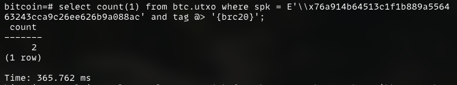
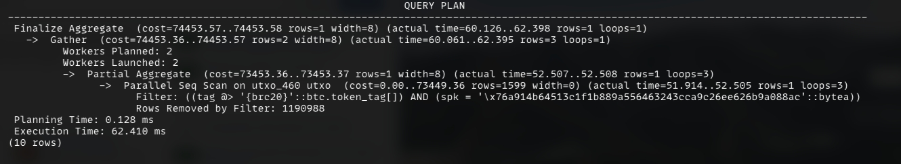
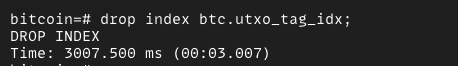
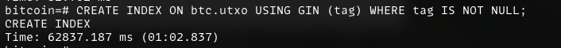
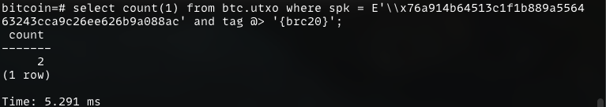
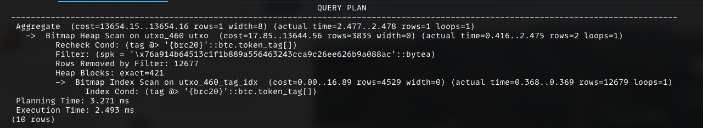

# Postgresql GIN Index 未使用问题记录

> 本文记录一下在使用postgresql时，创建的GIN索引未被执行引擎采纳的case原因及分析

## 1. 问题描述
业务需求需要记录utxo的数据，所以设计了如下表结构：
```sql
-- table utxo
CREATE TABLE btc.utxo
(
    spk         BYTEA   NOT NULL,              -- script public key
    script_type BYTEA   NOT NULL,              -- 当前输出锁定脚本类型
    tx_id       BYTEA   NOT NULL,              -- transaction id, little-endian
    vout        INT     NOT NULL,              -- vout
    satoshi     BIGINT  NOT NULL,              -- 当前utxo的金额，单位为satoshi
    height      INT     NOT NULL,              -- 区块高度
    tx_idx      INT     NOT NULL,              -- 所在交易在区块中的下标
    tag         btc.token_tag[] DEFAULT NULL,  -- 对原生bitcoin的扩展，对于bitcoin本身，tag为NULL

    PRIMARY KEY (spk, tx_id, vout)
) PARTITION BY HASH (spk);

-- index
CREATE INDEX ON btc.utxo (height ASC, tx_idx ASC, vout ASC);
CREATE INDEX ON btc.utxo USING GIN (tag) WHERE tag IS NOT NULL AND array_length(tag, 1) > 0;

-- partition
CREATE TABLE btc.utxo_0 PARTITION OF btc.utxo FOR VALUES WITH (MODULUS 1000, REMAINDER 0);
--- ...
```

当解析好utxo数据后，这个表记录了5亿条utxo数据，当我想查询某个地址包含某tag的utxo数据时:

发现耗时365ms，这远远超出我的预期，因为倒排索引过滤数据还是很快的，第一反应是分析一下query plan:

发现还是走了seq scan, 执行引擎并没有使用GIN索引

## 2. 问题解决
执行引擎没有选择GIN索引，肯定是因为GIN索引不划算或者有问题，我再次看到了GIN索引的定义:
```sql
CREATE INDEX ON btc.utxo USING GIN (tag) WHERE tag IS NOT NULL AND array_length(tag, 1) > 0;
```
有可能是`AND array_length(tag, 1) > 0`这个条件有问题，导致GIN索引未被使用，于是修改了索引，删掉了`AND array_length(tag, 1) > 0`条件:
```sql
CREATE INDEX ON btc.utxo USING GIN (tag) WHERE tag IS NOT NULL;
```


再次执行同样的查询

这次耗时降到了5ms，性能提升了73倍，再次查看query plan:

看到这次索引派上用场了！