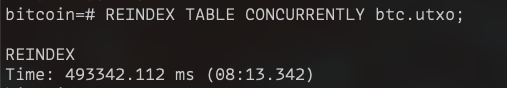
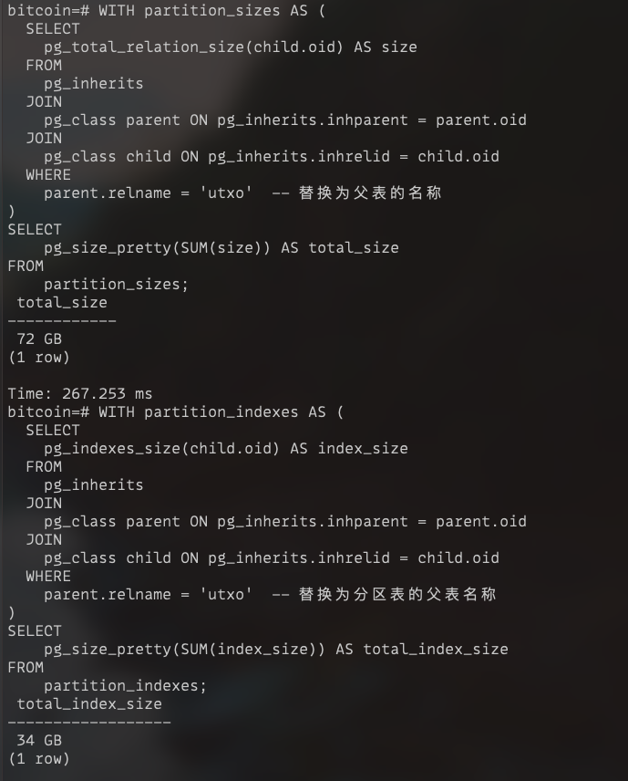
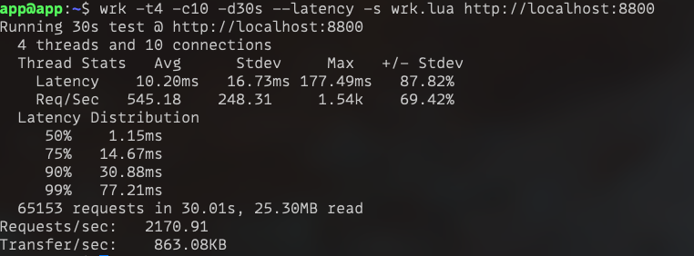

## 建表
```sql
create database bitcoin;
create user developer with password 'developer';
grant all privileges on database bitcoin to developer;

-- psql -U postgres -d bitcoin -f create_table.sql
grant all privileges on schema btc to developer;
grant all privileges on all tables in schema btc to developer;
```

## TODO
1. order by height, tx_idx, vout速度优化
2. read/write split
3. db直接存储大端编码的tx_id
4. rbf目前的逻辑不对，在insert on conflict do update的时候，其实每一次新产生的txid已经变了（已经改成全部删除再重新添加了）
5. pg out of shared memory
6. copyfrom比batch insert 快很多，但是copyfrom不支持insert on conflict do nothing
7. 因为在btc测试网上，出现了错误（Error: index row size exceeds btree version 4 maximum for index），主键索引和唯一性索引太长了超出了btree限制的长度，所以取消了分表，看看单表2亿数据的性能如何； 因为取消了分表，所以临时修改了建表语句，也修改了ON CONFLICT(spk, tx_id, vout)为ON CONLICT(tx_id, vout)
8. 索引膨胀问题，主键、唯一键已经比数据大了

## indexd:
1. 如果中途同步失败，重新同步的时候，是根据clickhouse的记录来判断起始高度的，这样是有问题的。如果clickhouse写成功了，而redis等其他服务没有写成功，这样就会有遗漏


batch end=860000 utxo=186121925

bc1qgdq67upw5909ctmm3t54zpk4xcz8ncm5ggafcr unisatquery查询出负余额

## PG config
```
listen_addresses = '*'
port = 5432


max_locks_per_transaction = '131072' # 2048 * 64

# work_mem 代表了每个操作的工作内存，比如执行某些内存密集型操作：排序、聚合等可以使用的内存量
# 是每个操作而不是每个查询
work_mem = '64MB'

# maintenance_wok_mem 代表维护操作的工作内存，比如CREATE INDEX, ALTER TABLE等
# 这些操作涉及的数据量一般比较大，所以一般也比work_mem大
maintenance_work_mem = '256MB'

# 代表共享缓冲区的大小，这些区域用来缓存表和索引的数据
# 比如在查询场景下，可以缓存下最近的查询数据块，避免频繁访问磁盘，提高查询性能
shared_buffers = ‘16GB'

# 告诉操作系统pg可以使用多少缓存，通常设置为总内存的50% - 75%
effective_cache_size = '24G'
```

## 我有一个关于pg的问题， 总是遇到out of shared memory这个错误，以下为我定位问题过程中获得的信息：
1. 我的表btc.utxo使用了分区， 分为了2048个区，分区键为spk。算上父表btc.utxo, 总共有2049张表。 每个表有4个索引（包括主键）；
2. 我执行的sql都为select *** from btc.utxo where spk = xxx; 这种查询会根据spk直接定位到具体的分区进行查询； 而select  语句会锁表(AccessShareLock)，一个事务的select *** from btc.utxo where spk = xxx语句会加10个锁（2（父表btc.utxo+字表btc.utxo_xxx） * 5(1个表锁+4个索引锁)）；
3.  我客户端使用的是golang 的pg库（github.com/jackc/pgx/v5/pgxpool ）， 这个库启用连接池进行查询， 而连接池的连接数量为4和runtime.NumCPU()中较大的一个，我的机器是32个CPU，所以， 客户端的连接数为32. 32个连接数代表可以同时向数据库服务发起32个连接，同时最大有32个select同时进行。 // 这点我核实过，通过golang 客户端的Stats()信息打印出来，确实是32个连接；在pg中查询select count(1) from pg_stat_activity也确实是32
4. 既然最大有32个select同时执行，那么每个select会加10个锁，最大也就加320个锁；
5. 我pg的配置项:max_connections = 100; max_locks_per_transaction=128. 这样允许加锁的数量为100 * 128 ‎ = 12,800; 这个数字远大于320。可我为什么还会遇到out of shared memory呢？


## 单表确实不行：


查询高达7分钟


## 索引 & 表大小
```sql
WITH partition_sizes AS (
  SELECT
    pg_total_relation_size(child.oid) AS size
  FROM
    pg_inherits
  JOIN
    pg_class parent ON pg_inherits.inhparent = parent.oid
  JOIN
    pg_class child ON pg_inherits.inhrelid = child.oid
  WHERE
    parent.relname = 'utxo'  -- 替换为父表的名称
)
SELECT
    pg_size_pretty(SUM(size)) AS total_size
FROM
    partition_sizes;
-- total size: 159G
```

```sql
WITH partition_indexes AS (
  SELECT
    pg_indexes_size(child.oid) AS index_size
  FROM
    pg_inherits
  JOIN
    pg_class parent ON pg_inherits.inhparent = parent.oid
  JOIN
    pg_class child ON pg_inherits.inhrelid = child.oid
  WHERE
    parent.relname = 'utxo'  -- 替换为分区表的父表名称
)
SELECT
    pg_size_pretty(SUM(index_size)) AS total_index_size
FROM
    partition_indexes;
-- total size: 121G
```

## reindex花了8分钟

index减少了约90G； 数据38G 索引34G; 定期重建索引是个好主意！！


## 压测
1. 压测结果 200个地址，都是选用的utxo比较多的地址, utxo数量分布：[662 - 483880]
